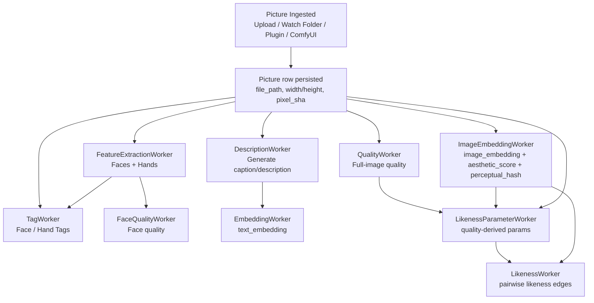
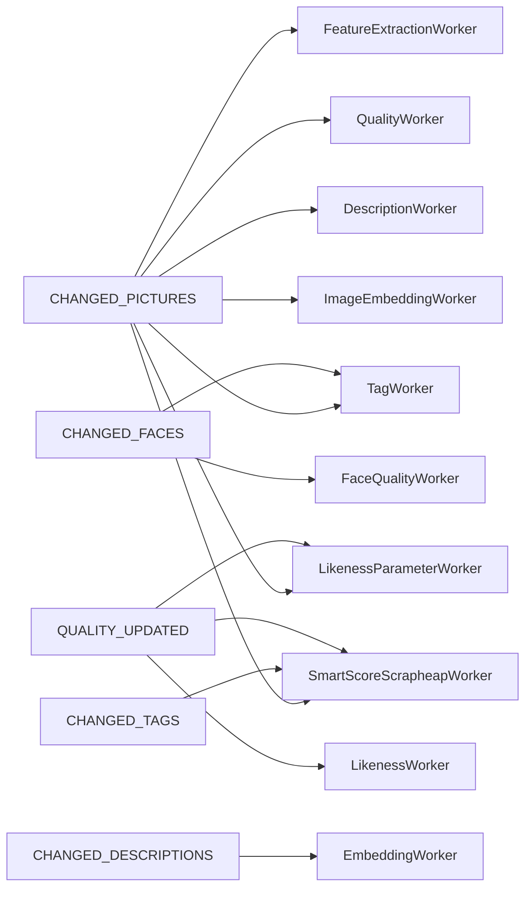

# Picture Processing Dependency Graph

This graph captures **all per-picture work** in the current backend and its dependencies.

## Current Pipeline DAG (as implemented)

## Dependency Notes

- `FeatureExtractionWorker` runs when a picture is missing faces or hands.
- `FaceQualityWorker` requires detected faces with bounding boxes.
- `TagWorker` can tag pictures directly and can also backfill missing face/hand tags after detection.
- `DescriptionWorker` only needs a picture; `EmbeddingWorker` needs `description` first.
- `ImageEmbeddingWorker` is prerequisite for smart score and likeness.
- `QualityWorker` is prerequisite for quality-derived likeness parameters and can feed smart score fallback.
- `LikenessParameterWorker` requires picture metadata and quality/image-derived inputs; it enqueues pictures for `LikenessWorker`.
- `LikenessWorker` requires: `image_embedding`, `likeness_parameters`, and `perceptual_hash`.
- `SmartScoreScrapheapWorker` currently gates on: `imported_at is null`, non-empty tags, embedding, and `(aesthetic_score or quality)`.

## Event Triggers (high level)

